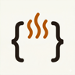
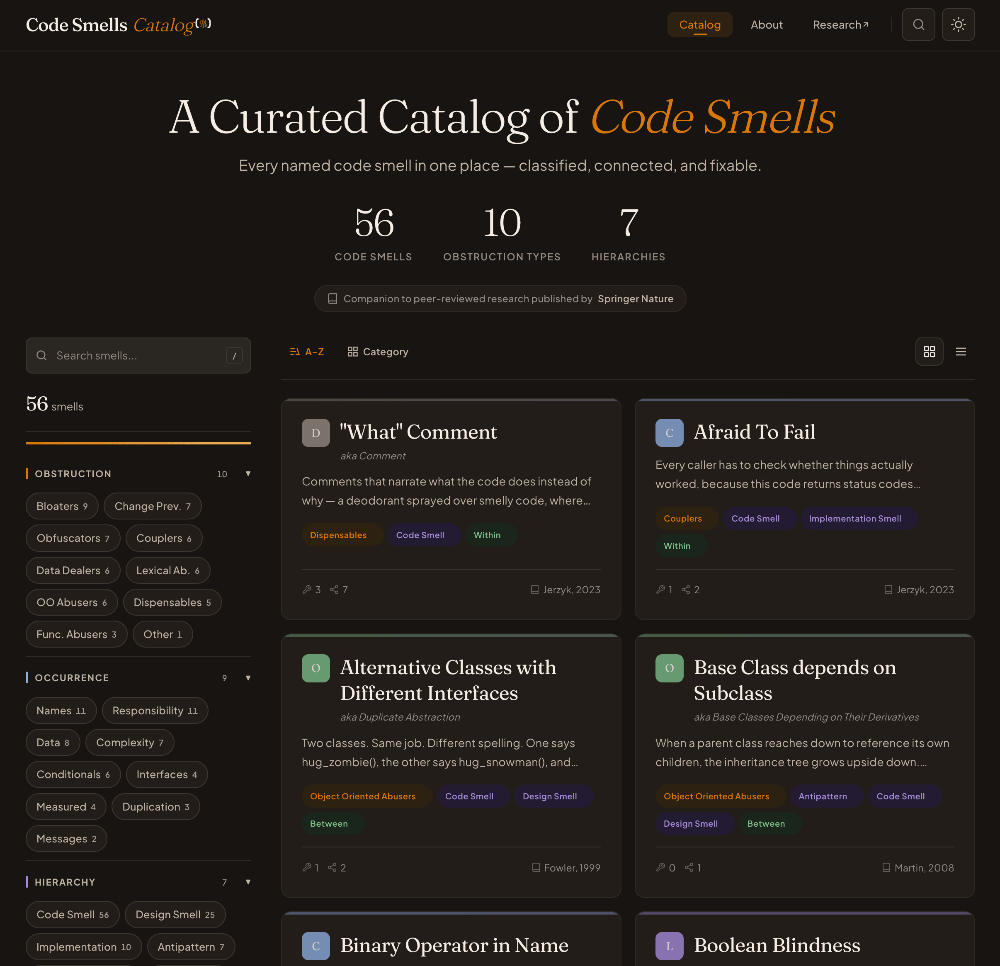

<div align="center">
    
    <h2>Code Smells Catalog</h2>
    <p><strong>56 code smells</strong> in one place, cross-referenced so you can find the one you're thinking of.</p>
    <p>
        <a href="https://codesmells.org"><strong>Browse the Catalog</strong></a> · <a href="https://link.springer.com/chapter/10.1007/978-3-031-25695-0_24">Springer Paper</a> · <a href="https://github.com/Luzkan/smells/tree/main/docs/thesis.pdf">Thesis</a>
    </p>
    <p>
        <a href="https://github.com/Luzkan/smells/actions/workflows/ci.yml"></a>
        <a href="https://github.com/Luzkan/smells/blob/main/LICENSE"></a>
        <a href="https://codesmells.org"></a>
        <a href="https://github.com/Luzkan/smells/stargazers"></a>
    </p>
</div>

<br/>

<p align="center">
    <a href="https://codesmells.org"></a>
</p>

---

## What's this?

Every named code smell in one place — classified, connected, and fixable.

56 code smells, each with its history, related smells, the problems it causes, and how to fix it. It's also a dataset: machine-readable content that researchers can extract with a single command.

Built as a companion to a [Springer Nature publication](https://link.springer.com/chapter/10.1007/978-3-031-25695-0_24) and [Master's thesis](https://github.com/Luzkan/smells/tree/main/docs/thesis.pdf).

---

## Who is this for?

### New Programmers

Browse it like a field guide. Each smell has a clear explanation, real code examples, and the refactoring techniques that fix it. You'll build intuition about what "bad code" actually means beyond "it doesn't work."

### Developers

It's much easier to handle a code review discussion when you can drop a link to a well-described, named phenomenon instead of arguing about _why_ something feels off. This catalog gives names to things you intuitively sense but struggle to articulate.

### Researchers

Data on code smells is scattered across decades of literature, and coverage is wildly disproportionate: some smells are studied constantly, others never made it past a single paper. This catalog tries to fix that. Consistent naming, traced origins, one taxonomy you can actually navigate.

The catalog is also a dataset. From the repository root:

```bash
python3 -m venv .venv
source .venv/bin/activate
python -m pip install -r data_scraper/requirements.txt
python -m data_scraper.main
```

Use `python -m data_scraper.main -h` to inspect the available flags. It parses the same markdown files into structured JSON, ready for analysis.

---

## Have you written any of these?

> [**Boolean Blindness**](https://codesmells.org/smells/boolean-blindness) — when `true` and `false` carry meaning only the original author remembers

> [**Afraid To Fail**](https://codesmells.org/smells/afraid-to-fail). Wrapping everything in try-catch instead of letting errors speak.

> [**Fate Over Action**](https://codesmells.org/smells/fate-over-action) — classes that are nouns all the way down, with no verbs in sight

> [**Fallacious Method Name**](https://codesmells.org/smells/fallacious-method-name). The name promises one thing. The body does another.

> [**Clever Code**](https://codesmells.org/smells/clever-code) — you were proud when you wrote it; nobody can read it now

There are 51 more. [Browse the full catalog →](https://codesmells.org)

---

## Contributing

If you'd like to contribute, you're very welcome. Open an [issue](https://github.com/Luzkan/smells/issues) to start a discussion or submit a [pull request](https://github.com/Luzkan/smells/pulls) directly. I'm deeply convinced that in a pile of stuff this size, I had to make mistakes, even just statistically speaking. 🐈

The barrier is intentionally low: **you don't need to know any programming languages.** Found a smell we missed? Know a better example? Spot a typo? Each smell is just a markdown file in [`content/smells/`](./content/smells/). Edit it right on GitHub.

---

<details>
<summary><strong>For Contributors</strong></summary>

### Getting Started

```bash
pnpm install
pnpm dev          # local dev server
pnpm build        # production build
pnpm test         # unit + integration tests
```

> Note: supported build and release workflows assume a full `pnpm install --frozen-lockfile` before running scripts. `pnpm install --prod` before `pnpm build` is intentionally unsupported; if that requirement changes later, move all build-required packages together instead of changing `gray-matter` alone.

### Project Structure

```
content/smells/     56 smell articles (Markdown + YAML frontmatter)
src/                Astro application: layouts, components, pages, stores
scripts/            Build-time helpers (OG images, redirect generation)
data_scraper/       Python tool that parses content into JSON for research
tests/              Unit, integration, and E2E tests
```

### Tech Stack

- [Astro 5](https://astro.build): content-first, zero JS by default
- [Preact](https://preactjs.com) for interactive islands (~4 KB)
- [Tailwind CSS v4](https://tailwindcss.com) for styling
- [Nano Stores](https://github.com/nanostores/nanostores): shared state across islands
- TypeScript throughout

</details>

---

## Citation

Jerzyk, M., Madeyski, L. (2023). Code Smells: A Comprehensive Online Catalog and Taxonomy. In: _Studies in Systems, Decision and Control_, vol 462. Springer, Cham. https://doi.org/10.1007/978-3-031-25695-0_24

```bibtex
@inproceedings{jerzyk2023codesmells,
  author    = {Jerzyk, Marcel and Madeyski, Lech},
  title     = {Code Smells: A Comprehensive Online Catalog and Taxonomy},
  booktitle = {Studies in Systems, Decision and Control},
  volume    = {462},
  year      = {2023},
  publisher = {Springer, Cham},
  doi       = {10.1007/978-3-031-25695-0_24}
}
```
